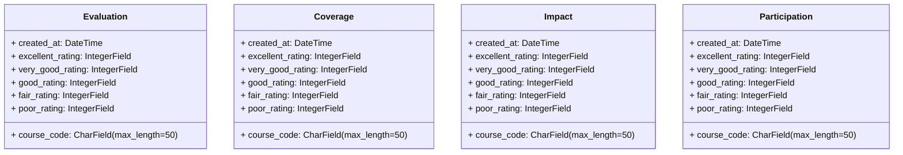

# Student Feedback System - Project README

Welcome to the Student Feedback System project repository. This repository contains the source code and documentation for our web application that facilitates the collection, analysis, and reporting of student feedback regarding courses, instructors, and campus facilities.

## About the Project

Our team of five embarked on developing a robust and user-friendly Student Feedback System using Django, a powerful web development framework. The system incorporates sentiment analysis to gain valuable insights from the feedback data, contributing to data-driven decision-making and improvements.

## Key Features

- Streamlined feedback collection process for students.
- Integration of sentiment analysis model for automatic feedback sentiment evaluation.
- Comprehensive reporting system to identify strengths and areas for improvement.
- User authentication and security measures for data privacy.

## System Diagrams

### Class Diagram - Evaluation, Coverage, Impact, and Participation Classes

---

## Use Case Diagram - Student Feedback Process

### Activity Diagram - Feedback Submission and Report Generation

## Download Project Report
For a detailed understanding of the project, including its development process, system architecture, and features, you can download the project report from the following link:
[Download Project Report]()

## How to Run the Project
To run the Student Feedback System locally, follow these steps:

- Clone this repository.
- create the virtual Environment `python venv -m env `
- Activate the Environment `env \Script\activate.bat`
- Install the required dependencies by running `pip install -r requirements.txt`.
- Run the migrations `python manage.py makemigrations`
- Migrate the models `python manage.py migrate`
- Run the Django development server using `python manage.py runserver`.
